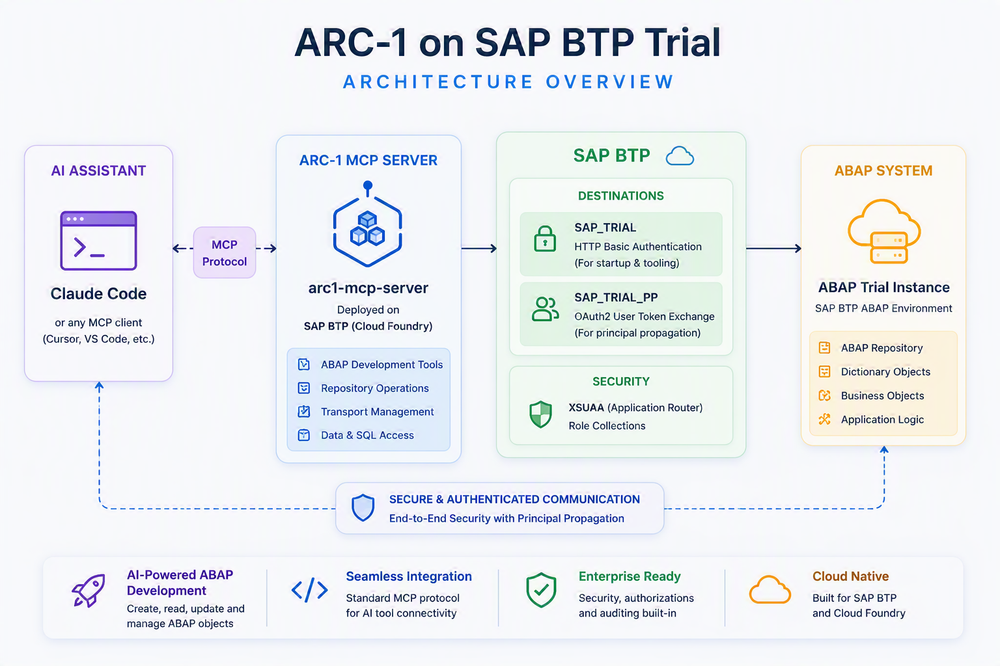
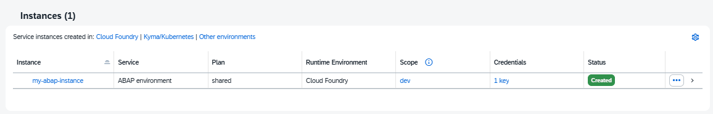
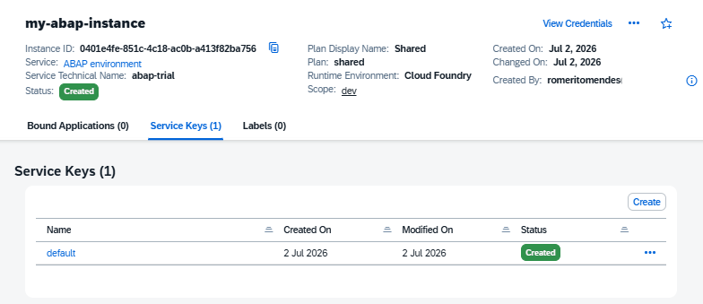
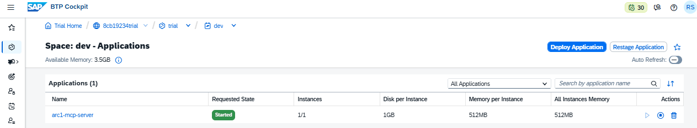
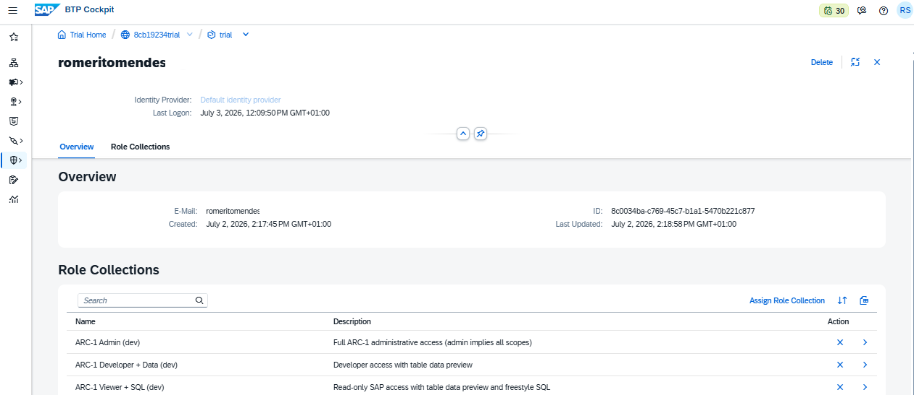
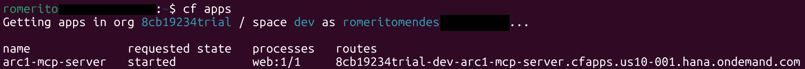

# ARC-1 + SAP BTP Trial: A Practical Guide for ABAP Developers

ARC-1 is a community-driven open-source MCP server that allows AI assistants such as Claude Code and GitHub Copilot to interact with ABAP systems. While the official project documentation is comprehensive, developers who simply want to validate the concept on a SAP BTP Trial account may find themselves navigating multiple deployment, authentication, and configuration options. This guide focuses on the shortest path to a working setup.



**Disclaimer:** *ARC-1 is an open-source community project and is not an official SAP product. This article describes one possible setup using SAP BTP Trial for evaluation and learning purposes.*

## Prerequisites

1. [Create a SAP BTP Trial Account.](https://discovery-center.cloud.sap/card/58250857-1c8e-440f-800a-a264969a3bc8)
2. [Install the Cloud Foundry CLI.](https://help.sap.com/docs/btp/sap-business-technology-platform/download-and-install-cloud-foundry-command-line-interface)
3. Log in to your Cloud Foundry subaccount.

```sh
cf login
```

## 1. Create an ABAP Trial Instance
https://cockpit.hanatrial.ondemand.com/trial/

## 2. Create a Local Configuration File
```json:params-trial.json
{
    "email": "youremail@mail.com"
}
```

## 3. Create the ABAP Cloud Trial

```sh
cf create-service abap-trial shared my-abap-instance -c .\params-trial.json
```



## 4. Create a Service Key

```sh
cf create-service-key my-abap-instance default
```



## 5. Display the Service Key

```sh
cf service-key my-abap-instance default
```

## 6. Create Destinations

ARC-1 requires two destinations:
- A Basic Authentication destination used during startup.
- An OAuth2 User Token Exchange destination used for principal propagation and user-specific requests.

### 6.1. Basic Auth

| Property | Value | Example |
| ---------- | ---------- | ---------- |
| Name | ```SAP_TRIAL``` | |
| Type | ```HTTP``` | |
| URL | ```http://<instanceID>.abap.<location>.hana.ondemand.com``` | ServiceKey: default.url |
| Authentication | ```BasicAuthentication``` | |
| User | ```Technical SAP user``` | ServiceKey: default.uaa.clientid |
| Password | ```Technical SAP password``` | ServiceKey: default.uaa.clientsecret |

### 6.2. Propagation

| Property | Value | Example |
| ---------- | ---------- | ---------- |
| Name | ```SAP_TRIAL_PP``` | |
| Type | ```HTTP``` | |
| URL | ```http://<instanceID>.abap.<location>.hana.ondemand.com``` | ServiceKey: default.url |
| Authentication | ```OAuth2UserTokenExchange``` | |
| Client ID | ```Technical SAP user``` | ServiceKey: default.uaa.clientid |
| Client Secret | ```Technical SAP password``` | ServiceKey: default.uaa.clientsecret |
| Token Service URL | ```http://<subaccount>.authentication.<location>.hana.ondemand.com/oauth/token``` | ServiceKey: default.uaa.url |

## 7. Clone the ARC-1 Repository

```sh
git clone https://github.com/arc-mcp/arc-1.git

cd arc-1
```

## 8. Create and Configure the MTA Extension File

```sh
cp mta-overrides.mtaext.example mta-overrides.mtaext
```

```mta
_schema-version: "3.1"
ID: arc1-mcp-overrides
extends: arc1-mcp

modules:
  - name: arc1-mcp-server
    properties:
      # ── Destinations (REQUIRED override) ─────────────────────────────
      # BasicAuth destination for startup (feature probing, cache warmup)
      SAP_BTP_DESTINATION: "SAP_TRIAL"

      # PrincipalPropagation destination for per-user requests (with JWT)
      SAP_BTP_PP_DESTINATION: "SAP_TRIAL_PP"

      # ── Principal propagation behaviour ──────────────────────────────
      # Enable per-user principal propagation (default in mta.yaml: true)
      SAP_PP_ENABLED: "true"

      # ── Safety / Authorization ───────────────────────────────────────
      # Enable object mutations (create, update, delete)
      SAP_ALLOW_WRITES: "true"

      # Enable transport mutations (release, create, add to transport).
      # Also requires SAP_ALLOW_WRITES=true.
      SAP_ALLOW_TRANSPORT_WRITES: "true"

      # Restrict writes to these packages (comma-separated, supports
      # wildcards). Default in mta.yaml: "$TMP".
      SAP_ALLOWED_PACKAGES: "Z*,Y*,$TMP"
    requires:
      - name: arc1-xsuaa
```

## 9. Build and Deploy ARC-1

```sh
npm ci

npm run btp:build-deploy-ext
```

The deployment process may take a few minutes. Once completed, verify that the application is running successfully:



## 10. Assign ARC-1 Roles
```sh
ARC-1 Admin (dev)
ARC-1 Developer + Data (dev)
ARC-1 Viewer + SQL (dev)
```



## 11. Retrieve the MCP Endpoint URL

```sh
cf apps
```



## 12. Register the MCP Server in Claude Code

```sh
claude mcp add --transport http ARC-TRIAL https://<subaccount>-dev-arc1-mcp-server.cfapps.<location>.hana.ondemand.com/mcp
```

## Conclusion

You now have a complete ARC-1 environment running on SAP BTP Trial and connected to your AI coding assistant.

From this point, you can start exploring AI-assisted ABAP development scenarios such as:

- Creating ABAP classes
- Creating CDS Views
- Managing repository objects
- Exploring existing development packages
- Working with transports
- Generating boilerplate code

If your goal was simply to validate the end-to-end ARC-1 experience without spending hours navigating documentation and deployment options, this setup should provide the fastest possible starting point.

Happy coding!